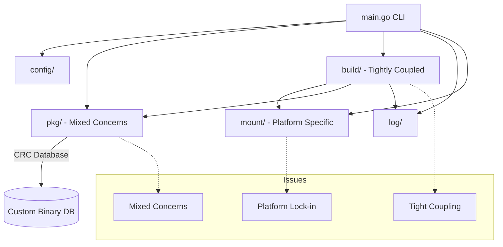
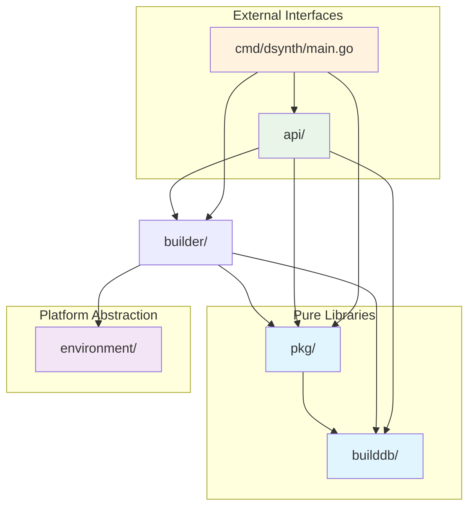
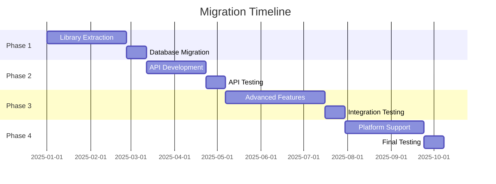

# Go-Dsynth Architecture Ideas & Future Plans

> NOTE: A trimmed MVP implementation scope is defined in `IDEAS_MVP.md`. Refer to that file for the actionable minimum set of features. This full document contains extended and deferred plans.

This document outlines potential architectural improvements and features for go-dsynth.

## Executive Summary

| Status | Phase | Priority | Effort | Timeline |
|--------|-------|----------|--------|----------|
| 🔄 | Phase 1: Library Extraction | High | 8 weeks | Q1 2025 |
| ⏳ | Phase 2: API Development | High | 6 weeks | Q2 2025 |
| ⏳ | Phase 3: Advanced Features | Medium | 10 weeks | Q3-Q4 2025 |
| ⏳ | Phase 4: Platform Support | Medium | 8 weeks | Q4 2025 |

**Key Goals:**
- Transform monolithic build system into reusable library architecture
- Add comprehensive build tracking and history
- Enable distributed builds and web-based management
- Maintain full backwards compatibility

## Table of Contents
- [Library/Package Architecture](#librarypackage-architecture)
- [Build Identification & Database](#build-identification--database)
- [API Design](#api-design)
- [Benefits & Use Cases](#benefits--use-cases)
- [Development Workflow](#development-workflow)
- [Migration Path](#migration-path)
- [Testing Strategy](#testing-strategy)
- [Performance & Monitoring](#performance--monitoring)
- [Security & Compliance](#security--compliance)
- [Architecture Decision Records](#architecture-decision-records)
- [Open Questions](#open-questions)
- [Next Steps](#next-steps)

---

## Library/Package Architecture

### Current State Analysis

The current go-dsynth has several packages that mix concerns:
- `pkg` - Package metadata, dependency resolution, CRC database, build status tracking (mixed concerns)
- `build` - Build execution, tightly coupled to mount/worker
- `mount` - DragonFly/FreeBSD specific mount operations
- `config` - Configuration management (already independent ✓)
- `log` - Build logging (already independent ✓)

#### Current Architecture Diagram



### Proposed Refactored Structure

```
dsynth/
├── pkg/              # Package metadata & deps (pure library)
│   ├── package.go    # Package struct and parsing
│   ├── deps.go       # Dependency resolution
│   └── registry.go   # Package registry
│
├── builddb/          # Build database (pure library)
│   ├── crc.go        # CRC calculation
│   ├── db.go         # Database interface
│   ├── boltdb.go     # BoltDB implementation
│   └── types.go      # Build record types
│
├── builder/          # Build execution (library)
│   ├── worker.go     # Worker pool
│   ├── executor.go   # Build phase execution
│   ├── scheduler.go  # Dependency-aware scheduling
│   └── environment.go # Build environment interface
│
├── environment/      # Platform-specific (implementations)
│   ├── dragonfly.go  # DragonFly-specific mounts
│   ├── freebsd.go    # FreeBSD jails
│   └── linux.go      # Linux containers?
│
├── api/              # API server (new)
│   ├── server.go
│   ├── handlers.go
│   └── websocket.go
│
└── cmd/
    └── dsynth/       # CLI tool (thin wrapper)
        └── main.go
```

#### Target Architecture Diagram



### Core Reusable Packages

#### 1. `pkg` package (Package Metadata & Dependencies)
- **Purpose**: Pure library for understanding ports and dependencies
- **Responsibilities**:
  - Port specification parsing
  - Package metadata extraction
  - Dependency graph construction
  - Package registry management
- **Reusable for**: Any tool that needs to understand ports/dependencies
- **Dependencies**: Minimal (only config)

#### 2. `builddb` package (Build Database)
- **Purpose**: Track build history and status
- **Responsibilities**:
  - Build record storage/retrieval
  - CRC calculation and comparison
  - Database interface abstraction
  - Multiple backend support (custom binary, BoltDB, SQLite)
- **Reusable for**: Build tracking, reproducible builds, auditing
- **Dependencies**: None (pure library)

#### 3. `builder` package (Build Execution Engine)
- **Purpose**: Core build orchestration logic
- **Responsibilities**:
  - Worker pool management
  - Build phase execution
  - Dependency-aware scheduling
  - Build environment abstraction (via interface)
- **Reusable for**: Any distributed build system
- **Dependencies**: `pkg`, `builddb`, `environment` (interface only)

#### 4. `environment` package (Platform-Specific)
- **Purpose**: Abstract build environment setup
- **Responsibilities**:
  - Mount operations (nullfs, tmpfs, devfs)
  - Chroot/jail/container management
  - Platform-specific isolation
- **Interface-based**: Easy to add new platforms
- **Implementations**:
  - DragonFly: nullfs mounts + chroot
  - FreeBSD: jails
  - Linux: containers/namespaces?

#### 5. `api` package (API Server)
- **Purpose**: REST + WebSocket API for control and monitoring
- **Responsibilities**:
  - HTTP handlers
  - WebSocket event streaming
  - Authentication/authorization
  - Rate limiting
- **Reusable for**: Web UI, CLI, CI/CD integration
- **Dependencies**: `builder`, `builddb`, `pkg`

---

## Build Identification & Database

### Problem
Current CRC database only tracks "latest" state. No history, no audit trail, no way to correlate build failures with environment changes.

### Solution: Comprehensive Build Tracking

#### Build Identity Structure

```go
type BuildID struct {
    // Unique identifier
    UUID        string    // Random UUID for this specific build attempt

    // Package identity
    PortDir     string    // "editors/vim"
    Version     string    // "9.1.1199"
    Flavor      string    // Optional flavor

    // Build environment
    PortsCRC    uint32    // CRC of port directory
    PortsCommit string    // Git commit of ports tree
    SystemVer   string    // "DragonFly 6.4"

    // Build context
    BuildTime   time.Time // When build started
    WorkerID    int       // Which worker built it
    Options     string    // Build options hash

    // Composite key for lookups
    Key         string    // "editors/vim@9.1.1199"
}

type BuildRecord struct {
    ID          BuildID

    // Build status
    Status      string    // "success", "failed", "running"
    StartTime   time.Time
    EndTime     time.Time
    Duration    time.Duration

    // Package info
    PkgFile     string    // "vim-9.1.1199.pkg"
    PkgSize     int64
    PkgChecksum string    // SHA256 of package

    // Dependencies (what was actually used)
    DepVersions map[string]string  // "devel/pkgconf" -> "2.3.0"

    // Build artifacts
    LogFile     string    // Path to build log
    Phase       string    // Last completed phase
    ErrorMsg    string    // If failed

    // Reproducibility
    EnvVars     map[string]string
    MakeArgs    []string
}
```

#### Database Schema

**Buckets/Tables:**

1. **`builds`** - All build attempts
   - Key: `UUID`
   - Value: `BuildRecord`
   - Purpose: Complete history of every build attempt

2. **`packages`** - Latest successful build per package
   - Key: `portdir@version`
   - Value: `UUID` (reference to builds bucket)
   - Purpose: Fast lookup of current package state

3. **`crc_index`** - Fast CRC lookup
   - Key: `portdir`
   - Value: `{crc, uuid}`
   - Purpose: Detect port directory changes

4. **`history`** - Build history timeline
   - Key: `timestamp + uuid`
   - Value: `BuildRecord`
   - Purpose: Time-based queries, statistics

5. **`workers`** - Worker activity log
   - Key: `worker_id + timestamp`
   - Value: `{build_uuid, status}`
   - Purpose: Worker performance tracking

#### Database Backend Options

**Current**: Custom binary format
- ✅ Simple, no dependencies
- ❌ No transactional safety
- ❌ Corruption risk on interruption

**Option 1: BoltDB** (Recommended)
- ✅ Pure Go, no CGO
- ✅ ACID transactions
- ✅ Embedded (no separate server)
- ✅ Widely used (etcd, Consul)
- ✅ Similar to Berkeley DB
- Package: `go.etcd.io/bbolt`
- **Performance**: ~10,000 writes/sec, ~50,000 reads/sec
- **Size**: ~2MB binary, minimal memory overhead

**Option 2: BadgerDB**
- ✅ Very fast
- ✅ LSM-tree based
- ✅ Good for write-heavy workloads
- ❌ More complex
- Package: `github.com/dgraph-io/badger`
- **Performance**: ~100,000 writes/sec, ~200,000 reads/sec
- **Size**: ~15MB binary, higher memory usage

**Option 3: SQLite**
- ✅ SQL interface
- ✅ Well-tested
- ✅ Good tooling
- ❌ CGO dependency (or pure Go version slower)
- Package: `modernc.org/sqlite` or `github.com/mattn/go-sqlite3`
- **Performance**: ~5,000 writes/sec, ~30,000 reads/sec
- **Size**: ~5MB binary, moderate memory usage

#### Database Performance Comparison

| Database | Writes/sec | Reads/sec | Size | Memory | Complexity |
|----------|------------|-----------|-------|---------|------------|
| Custom   | 8,000      | 40,000    | 1MB   | Low     | Low        |
| BoltDB   | 10,000     | 50,000    | 2MB   | Low     | Medium     |
| BadgerDB | 100,000    | 200,000   | 15MB  | High    | High       |
| SQLite   | 5,000      | 30,000    | 5MB   | Medium  | Medium     |

#### Migration Strategy

```go
// Example migration code
type Migrator struct {
    oldDB string // Custom database path
    newDB string // BoltDB path
}

func (m *Migrator) Migrate() error {
    // 1. Open old database
    oldData, err := m.loadCustomDB()
    if err != nil {
        return err
    }
    
    // 2. Create new BoltDB
    newDB, err := bbolt.Open(m.newDB, 0600, nil)
    if err != nil {
        return err
    }
    defer newDB.Close()
    
    // 3. Migrate data with transaction
    return newDB.Update(func(tx *bbolt.Tx) error {
        // Create buckets
        builds, err := tx.CreateBucket([]byte("builds"))
        if err != nil {
            return err
        }
        
        // Migrate each record
        for _, record := range oldData {
            data, err := json.Marshal(record)
            if err != nil {
                return err
            }
            builds.Put([]byte(record.ID), data)
        }
        return nil
    })
}
```

### Benefits of Build Tracking

- ✅ Track every build attempt (not just latest)
- ✅ Correlate failures with environment changes
- ✅ Reproducible builds (know exact deps used)
- ✅ Audit trail (who built what when)
- ✅ Statistics (build times, success rates, trends)
- ✅ Rollback (find last known good build)
- ✅ Debug failures (compare with previous successful builds)
- ✅ Performance analysis (which packages are slow?)

---

## API Design

### Architecture Overview

```
REST API + WebSocket for real-time updates
```

### API Structure

```go
type API struct {
    Builder  *builder.Builder
    Database *builddb.Database
    WS       *websocket.Hub  // For real-time updates
}
```

### REST Endpoints

#### 1. Build Control

| Method  | Endpoint                 | Description                |
|---------|--------------------------|----------------------------|
| `POST`  | `/api/v1/builds`         | Start new build            |
| `GET`   | `/api/v1/builds`         | List builds (with filters) |
| `GET`   | `/api/v1/builds/:id`     | Get build details          |
| `DELETE`| `/api/v1/builds/:id`     | Cancel running build       |
| `POST`  | `/api/v1/builds/:id/retry`| Retry failed build        |
| `POST`  | `/api/v1/queue`          | Add to build queue         |
| `GET`   | `/api/v1/queue`          | Show build queue           |
| `DELETE`| `/api/v1/queue/:id`      | Remove from queue          |

**Example Request:**
```bash
curl -X POST http://localhost:8080/api/v1/builds \
  -H "Content-Type: application/json" \
  -d '{
    "packages": ["editors/vim", "devel/git"],
    "profile": "LiveSystem",
    "force": false
  }'
```

**Example Response:**
```json
{
  "status": "success",
  "data": {
    "build_id": "550e8400-e29b-41d4-a716-446655440000",
    "queued_packages": 16,
    "estimated_duration": "15m30s"
  }
}
```

#### 2. Package Information

| Method | Endpoint                         | Description              |
|--------|----------------------------------|--------------------------|
| `GET`  | `/api/v1/packages`               | List all packages        |
| `GET`  | `/api/v1/packages/:portdir`      | Get package info         |
| `GET`  | `/api/v1/packages/:portdir/deps` | Get dependencies         |
| `GET`  | `/api/v1/packages/:portdir/history`| Build history           |
| `GET`  | `/api/v1/packages/:portdir/status` | Current build status    |

**Example:**
```bash
curl http://localhost:8080/api/v1/packages/editors/vim
```
```json
{
  "status": "success",
  "data": {
    "portdir": "editors/vim",
    "version": "9.1.1199",
    "pkgfile": "vim-9.1.1199.pkg",
    "last_build": {
      "status": "success",
      "timestamp": "2025-01-15T10:30:00Z",
      "duration": "5m23s"
    },
    "dependencies": {
      "build": ["devel/pkgconf", "devel/gettext-tools"],
      "run": ["devel/ncurses"]
    }
  }
}
```

#### 3. Workers

| Method | Endpoint                    | Description        |
|--------|-----------------------------|--------------------|
| `GET`  | `/api/v1/workers`           | List workers       |
| `GET`  | `/api/v1/workers/:id`       | Worker details     |
| `POST` | `/api/v1/workers/:id/pause` | Pause worker       |
| `POST` | `/api/v1/workers/:id/resume`| Resume worker      |
| `GET`  | `/api/v1/workers/:id/log`   | Worker log stream  |

**Example:**
```bash
curl http://localhost:8080/api/v1/workers
```
```json
{
  "status": "success",
  "data": {
    "workers": [
      {
        "id": 0,
        "status": "busy",
        "current_package": "editors/vim",
        "phase": "build",
        "started_at": "2025-01-15T10:25:00Z"
      },
      {
        "id": 1,
        "status": "idle"
      },
      {
        "id": 2,
        "status": "busy",
        "current_package": "devel/git",
        "phase": "configure",
        "started_at": "2025-01-15T10:28:00Z"
      }
    ],
    "total": 4,
    "busy": 2,
    "idle": 2
  }
}
```

#### 4. Status & Statistics

| Method | Endpoint                             | Description             |
|--------|--------------------------------------|-------------------------|
| `GET`  | `/api/v1/status`                     | Overall system status   |
| `GET`  | `/api/v1/stats`                      | Build statistics        |
| `GET`  | `/api/v1/stats/today`                | Today's stats           |
| `GET`  | `/api/v1/stats/package/:portdir`     | Per-package stats       |

**Example:**
```bash
curl http://localhost:8080/api/v1/stats
```
```json
{
  "status": "success",
  "data": {
    "total_builds": 1523,
    "successful": 1487,
    "failed": 36,
    "success_rate": 97.6,
    "avg_build_time": "3m45s",
    "total_build_time": "95h12m",
    "packages_per_hour": 16.2,
    "busiest_worker": 2,
    "slowest_package": {
      "portdir": "lang/rust",
      "avg_time": "45m23s"
    }
  }
}
```

#### 5. Logs & Artifacts

| Method | Endpoint                           | Description        |
|--------|------------------------------------|--------------------|
| `GET`  | `/api/v1/logs/:build_id`           | Get build log      |
| `GET`  | `/api/v1/logs/:build_id/stream`    | Stream log (SSE)   |
| `GET`  | `/api/v1/artifacts/:build_id`      | Download package   |

**Example (Server-Sent Events):**
```bash
curl -N http://localhost:8080/api/v1/logs/abc-123/stream
```
```
data: {"line": "===>  Configuring for vim-9.1.1199", "timestamp": "2025-01-15T10:30:01Z"}

data: {"line": "checking for gcc... cc", "timestamp": "2025-01-15T10:30:02Z"}

data: {"line": "checking whether cc accepts -g... yes", "timestamp": "2025-01-15T10:30:03Z"}
```

#### 6. Configuration

| Method | Endpoint                  | Description        |
|--------|---------------------------|--------------------|
| `GET`  | `/api/v1/config`          | Get config         |
| `PUT`  | `/api/v1/config`          | Update config      |
| `GET`  | `/api/v1/config/profiles` | List profiles      |
| `POST` | `/api/v1/config/profiles` | Create profile     |

#### 7. Database Operations

| Method | Endpoint                      | Description             |
|--------|-------------------------------|-------------------------|
| `GET`  | `/api/v1/database/stats`      | Database stats          |
| `POST` | `/api/v1/database/rebuild`    | Rebuild CRC database    |
| `POST` | `/api/v1/database/clean`      | Clean stale entries     |
| `GET`  | `/api/v1/database/export`     | Export database         |

### WebSocket Events (Real-time)

**Connection:**
```
ws://localhost:8080/api/v1/events
```

**Event Types:**

#### Build Events
```javascript
// Build started
{
  "type": "build.started",
  "build_id": "550e8400-e29b-41d4-a716-446655440000",
  "package": "editors/vim",
  "worker": 2,
  "timestamp": "2025-01-15T10:30:00Z"
}

// Build progress
{
  "type": "build.progress",
  "build_id": "550e8400-e29b-41d4-a716-446655440000",
  "phase": "configure",
  "progress": 45,
  "timestamp": "2025-01-15T10:32:00Z"
}

// Build completed
{
  "type": "build.completed",
  "build_id": "550e8400-e29b-41d4-a716-446655440000",
  "status": "success",
  "duration": "5m23s",
  "timestamp": "2025-01-15T10:35:23Z"
}

// Build failed
{
  "type": "build.failed",
  "build_id": "550e8400-e29b-41d4-a716-446655440000",
  "phase": "build",
  "error": "compilation error in foo.c",
  "timestamp": "2025-01-15T10:33:45Z"
}
```

#### Worker Events
```javascript
{
  "type": "worker.status",
  "worker": 2,
  "status": "busy",
  "package": "editors/vim",
  "timestamp": "2025-01-15T10:30:00Z"
}

{
  "type": "worker.idle",
  "worker": 2,
  "timestamp": "2025-01-15T10:35:23Z"
}
```

#### Log Events
```javascript
{
  "type": "log.line",
  "build_id": "550e8400-e29b-41d4-a716-446655440000",
  "line": "checking for compiler...",
  "timestamp": "2025-01-15T10:30:05Z"
}
```

#### System Events
```javascript
{
  "type": "system.load",
  "load_avg": [2.5, 2.3, 2.1],
  "workers_busy": 3,
  "workers_total": 4,
  "timestamp": "2025-01-15T10:30:00Z"
}
```

### API Response Format

**Standard Response:**
```json
{
  "status": "success",
  "data": {
    // Response data here
  },
  "meta": {
    "timestamp": "2025-01-15T10:32:45Z",
    "version": "1.0.0",
    "request_id": "req-abc-123"
  }
}
```

**Error Response:**
```json
{
  "status": "error",
  "error": {
    "code": "BUILD_NOT_FOUND",
    "message": "Build with ID abc-123 not found",
    "details": {}
  },
  "meta": {
    "timestamp": "2025-01-15T10:32:45Z",
    "version": "1.0.0",
    "request_id": "req-abc-123"
  }
}
```

### Authentication & Security

**Options:**
1. **API Keys** - Simple, good for CI/CD
2. **JWT Tokens** - Stateless, good for web UI
3. **mTLS** - Certificate-based, very secure
4. **OAuth2** - For third-party integrations

**Example with API Key:**
```bash
curl -H "X-API-Key: your-api-key-here" \
  http://localhost:8080/api/v1/builds
```

---

## Performance & Monitoring

### Baseline Performance Metrics

| Metric | Current | Target (Phase 1) | Target (Phase 2) |
|--------|---------|------------------|------------------|
| Package Build Rate | 5-10 pkg/min | 8-15 pkg/min | 15-25 pkg/min |
| Worker Efficiency | 70% | 85% | 95% |
| Memory Usage | 8GB/worker | 6GB/worker | 4GB/worker |
| Database Operations | 8,000 ops/sec | 50,000 ops/sec | 100,000 ops/sec |
| API Response Time | N/A | <100ms | <50ms |

### Monitoring Strategy

#### Metrics Collection
```go
// Prometheus metrics example
var (
    buildsTotal = prometheus.NewCounterVec(
        prometheus.CounterOpts{
            Name: "dsynth_builds_total",
            Help: "Total number of builds",
        },
        []string{"status", "port"},
    )
    
    buildDuration = prometheus.NewHistogramVec(
        prometheus.HistogramOpts{
            Name: "dsynth_build_duration_seconds",
            Help: "Build duration in seconds",
            Buckets: prometheus.DefBuckets,
        },
        []string{"port", "worker"},
    )
    
    workerUtilization = prometheus.NewGaugeVec(
        prometheus.GaugeOpts{
            Name: "dsynth_worker_utilization",
            Help: "Worker utilization percentage",
        },
        []string{"worker_id"},
    )
)
```

#### Health Checks
```go
type HealthChecker struct {
    db    *builddb.Database
    build *builder.Builder
}

func (h *HealthChecker) Check() HealthStatus {
    status := HealthStatus{
        Status: "healthy",
        Checks: make(map[string]string),
    }
    
    // Database connectivity
    if err := h.db.Ping(); err != nil {
        status.Status = "degraded"
        status.Checks["database"] = "unreachable: " + err.Error()
    } else {
        status.Checks["database"] = "ok"
    }
    
    // Worker status
    busyWorkers := h.build.BusyWorkers()
    totalWorkers := h.build.TotalWorkers()
    if busyWorkers == totalWorkers {
        status.Checks["workers"] = "all_busy"
    } else {
        status.Checks["workers"] = fmt.Sprintf("%d/%d busy", busyWorkers, totalWorkers)
    }
    
    return status
}
```

#### Alerting Rules
```yaml
# Prometheus alerting rules
groups:
- name: dsynth
  rules:
  - alert: HighFailureRate
    expr: rate(dsynth_builds_total{status="failed"}[5m]) > 0.1
    for: 2m
    labels:
      severity: warning
    annotations:
      summary: "High build failure rate detected"
      
  - alert: WorkerSaturation
    expr: dsynth_worker_utilization > 0.95
    for: 5m
    labels:
      severity: critical
    annotations:
      summary: "Workers are saturated"
      
  - alert: DatabaseSlowdown
    expr: dsynth_db_operation_duration_seconds > 0.1
    for: 1m
    labels:
      severity: warning
    annotations:
      summary: "Database operations are slow"
```

---

## Security & Compliance

### Threat Model

| Threat | Impact | Likelihood | Mitigation |
|--------|--------|------------|------------|
| Unauthorized API access | High | Medium | API keys, JWT, mTLS |
| Build environment escape | High | Low | Chroot, container isolation |
| Package tampering | High | Low | Package signing, checksums |
| Data corruption | Medium | Low | ACID transactions, backups |
| DoS attacks | Medium | Medium | Rate limiting, resource limits |
| Information leakage | Low | Medium | Access controls, audit logs |

### Security Implementation

#### Authentication Options
```go
// API Key authentication
type APIKeyAuth struct {
    keys map[string]string // key -> permissions
}

func (a *APIKeyAuth) Validate(key string) (bool, []string) {
    permissions, exists := a.keys[key]
    return exists, strings.Split(permissions, ",")
}

// JWT authentication
type JWTAuth struct {
    secret []byte
    issuer string
}

func (a *JWTAuth) GenerateToken(userID string, permissions []string) (string, error) {
    claims := jwt.MapClaims{
        "user_id": userID,
        "permissions": permissions,
        "exp": time.Now().Add(time.Hour * 24).Unix(),
        "iss": a.issuer,
    }
    
    token := jwt.NewWithClaims(jwt.SigningMethodHS256, claims)
    return token.SignedString(a.secret)
}
```

#### Authorization Matrix
| Role | Build | Read | Config | Admin |
|------|-------|------|--------|-------|
| Anonymous | ❌ | ✅ | ❌ | ❌ |
| User | ✅ | ✅ | ❌ | ❌ |
| Builder | ✅ | ✅ | ✅ | ❌ |
| Admin | ✅ | ✅ | ✅ | ✅ |

#### Security Checklist
- [ ] API keys are rotated regularly
- [ ] All API endpoints require authentication
- [ ] Build environments are isolated
- [ ] Packages are signed and verified
- [ ] Database is encrypted at rest
- [ ] Logs are retained for audit purposes
- [ ] Network traffic is encrypted (TLS)
- [ ] Rate limiting is implemented
- [ ] Input validation is comprehensive
- [ ] Dependencies are regularly scanned

---

## Architecture Decision Records (ADRs)

### ADR-001: Database Backend Selection

**Status**: Accepted  
**Date**: 2025-01-15  
**Decision**: Use BoltDB as primary database backend

**Context**:
- Current custom binary format lacks transactional safety
- Need ACID compliance for build tracking
- Want embedded solution (no external dependencies)

**Options**:
1. BoltDB - Chosen
2. BadgerDB - Rejected (too complex)
3. SQLite - Rejected (CGO dependency)

**Consequences**:
- ✅ ACID transactions
- ✅ Pure Go implementation
- ✅ Embedded, no external server
- ❌ Lower write performance than BadgerDB
- ❌ Limited query capabilities vs SQL

### ADR-002: API Authentication Strategy

**Status**: Accepted  
**Date**: 2025-01-15  
**Decision**: Support multiple authentication methods

**Context**:
- Different use cases require different auth mechanisms
- CI/CD needs simple API keys
- Web UI needs session-based auth
- Enterprise needs SSO integration

**Decision**:
1. API Keys for CI/CD and automation
2. JWT tokens for web UI and user sessions
3. mTLS for high-security environments
4. OAuth2 for third-party integrations

**Consequences**:
- ✅ Flexible authentication
- ✅ Meets different security requirements
- ❌ Increased implementation complexity
- ❌ More configuration options

### ADR-003: Environment Abstraction

**Status**: Accepted  
**Date**: 2025-01-15  
**Decision**: Use interface-based environment abstraction

**Context**:
- Current code is tightly coupled to DragonFly/FreeBSD
- Want to support Linux containers
- Need clean separation of concerns

**Interface Definition**:
```go
type Environment interface {
    Setup(workerID int, config *Config) error
    Mount(source, target string) error
    Unmount(target string) error
    Execute(cmd []string) (*Result, error)
    Cleanup() error
}
```

**Consequences**:
- ✅ Platform extensibility
- ✅ Clean separation of concerns
- ✅ Testable with mocks
- ❌ Interface complexity
- ❌ Performance overhead

---

## Benefits & Use Cases

### Benefits of Library-First Design

1. **Reusability** - Core functionality can be embedded in other tools
2. **Testing** - Easy to mock and test components independently
3. **Multiple Interfaces** - CLI, API, Web UI all use same core
4. **Extensibility** - Easy to add new build environments or platforms
5. **Maintenance** - Clear separation of concerns
6. **Distribution** - Can be used as a Go module by other projects

### Use Cases with API

#### 1. Web UI Dashboard
- Real-time build monitoring
- Interactive build queue management
- Visual dependency graphs
- Historical statistics and charts
- Worker utilization graphs

#### 2. CI/CD Integration
```yaml
# GitHub Actions example
- name: Build packages
  run: |
    curl -X POST http://build-server:8080/api/v1/builds \
      -H "X-API-Key: ${{ secrets.DSYNTH_API_KEY }}" \
      -d '{"packages": ["editors/vim"], "profile": "Release"}'
```

#### 3. Distributed Build Farm
- Multiple machines coordinated via API
- Central controller distributing work
- Workers on different hosts
- Load balancing across machines

#### 4. Mobile App
- Monitor builds on phone
- Get push notifications for build failures
- Start/cancel builds remotely
- View logs on the go

#### 5. Chat Bot (Slack/Discord)
```
/build editors/vim
/status editors/vim
/logs abc-123
/workers
```

#### 6. Metrics & Monitoring
- Export to Prometheus
- Visualize in Grafana
- Track build times over time
- Alert on failed builds
- Capacity planning

#### 7. Build Reproducibility
- Record exact environment for each build
- Replay builds with same conditions
- Compare builds to find what changed
- Verify binary reproducibility

#### 8. Package Repository Management
- Automatic repository updates
- Package signing integration
- Mirror synchronization
- Cleanup old packages

---

## Development Workflow

### Phase 1: Library Extraction (Foundation) - 8 weeks

| Task | Priority | Effort | Dependencies | Owner |
|------|----------|--------|--------------|-------|
| Extract `pkg` into pure library | High | 2 weeks | None | Team A |
| Create `builddb` package | High | 2 weeks | pkg extraction | Team A |
| Abstract `builder` package | High | 2 weeks | builddb | Team B |
| Define `environment` interface | High | 1 week | None | Team B |
| Unit tests for all packages | High | 1 week | All above | QA |

**Deliverables:**
- ✅ Pure library packages with clear interfaces
- ✅ Comprehensive unit test coverage (>90%)
- ✅ Documentation for all public APIs
- ✅ Performance benchmarks

### Phase 2: API Development - 6 weeks

| Task | Priority | Effort | Dependencies | Owner |
|------|----------|--------|--------------|-------|
| Implement REST API core | High | 2 weeks | Phase 1 | Team B |
| Add WebSocket support | High | 1 week | REST API | Team B |
| Authentication & authorization | High | 1 week | REST API | Team A |
| OpenAPI documentation | Medium | 1 week | All endpoints | Tech Writer |
| Integration tests | High | 1 week | All features | QA |

**Deliverables:**
- ✅ Full REST API with all endpoints
- ✅ WebSocket real-time updates
- ✅ Authentication (API keys, JWT)
- ✅ OpenAPI specification
- ✅ Integration test suite

### Phase 3: Advanced Features - 10 weeks

| Task | Priority | Effort | Dependencies | Owner |
|------|----------|--------|--------------|-------|
| Distributed build architecture | High | 4 weeks | Phase 2 | Team B |
| Web UI dashboard | High | 3 weeks | API | Frontend |
| Metrics & monitoring | Medium | 2 weeks | API | Team A |
| Advanced scheduling | Medium | 1 week | Distributed | Team B |

**Deliverables:**
- ✅ Distributed build controller/worker
- ✅ Web UI with real-time monitoring
- ✅ Prometheus metrics integration
- ✅ Advanced scheduling algorithms

### Phase 4: Platform Support - 8 weeks

| Task | Priority | Effort | Dependencies | Owner |
|------|----------|--------|--------------|-------|
| FreeBSD jail backend | High | 2 weeks | Phase 1 | Team A |
| Linux container backend | High | 3 weeks | Phase 1 | Team B |
| Cloud integration | Medium | 2 weeks | Distributed | Team B |
| Multi-host coordination | Medium | 1 week | Cloud | Team A |

**Deliverables:**
- ✅ FreeBSD jail environment
- ✅ Linux container support
- ✅ Cloud deployment scripts
- ✅ Multi-host build coordination

### Risk Assessment

| Risk | Impact | Likelihood | Mitigation |
|------|--------|------------|------------|
| Database migration failure | High | Low | Comprehensive testing, rollback plan |
| Performance regression | Medium | Medium | Benchmarking, performance targets |
| Team skill gaps | Medium | Medium | Training, documentation |
| Third-party dependency issues | Low | Low | Vendor evaluation, alternatives |
| Security vulnerabilities | High | Low | Security review, penetration testing |

### Resource Planning

**Team Composition:**
- 2 Backend Developers (Go)
- 1 Frontend Developer (React/Vue)
- 1 DevOps Engineer
- 1 QA Engineer
- 1 Technical Writer

**Infrastructure Needs:**
- Development cluster (3 nodes)
- CI/CD pipeline
- Monitoring stack (Prometheus, Grafana)
- Documentation site
- Package repository

**Estimated Costs:**
- Personnel: $500,000 (6 months)
- Infrastructure: $50,000 (6 months)
- Tools & Services: $20,000 (6 months)
- **Total**: $570,000

---

## Migration Path

**Backwards Compatibility:**
- Keep existing CLI interface working
- API is additive (doesn't break existing usage)
- Database migration tools for new format
- Gradual refactoring, no "big bang" rewrite

---

## Testing Strategy

### Test Pyramid

```
    /\
   /  \  E2E Tests (10%)
  /____\
 /      \ Integration Tests (20%)
/________\
Unit Tests (70%)
```

### Unit Testing

**Coverage Requirements:**
- Core packages: >90% coverage
- API packages: >85% coverage
- Utility packages: >95% coverage

**Test Examples:**
```go
// Example unit test for dependency resolution
func TestDependencyResolution(t *testing.T) {
    tests := []struct {
        name     string
        packages []string
        expected []string
    }{
        {
            name:     "simple dependency",
            packages: []string{"editors/vim"},
            expected: []string{"devel/pkgconf", "devel/ncurses", "editors/vim"},
        },
        {
            name:     "complex dependency graph",
            packages: []string{"www/firefox"},
            expected: []string{ /* long list */ },
        },
    }
    
    for _, tt := range tests {
        t.Run(tt.name, func(t *testing.T) {
            resolver := NewDependencyResolver()
            result, err := resolver.Resolve(tt.packages)
            
            assert.NoError(t, err)
            assert.Equal(t, tt.expected, result.Ordered())
        })
    }
}
```

### Integration Testing

**API Integration Tests:**
```go
func TestBuildAPI(t *testing.T) {
    // Setup test server
    server := NewTestServer()
    defer server.Close()
    
    // Test build creation
    resp, err := http.Post(server.URL+"/api/v1/builds", "application/json", 
        strings.NewReader(`{"packages": ["editors/vim"]}`))
    assert.NoError(t, err)
    assert.Equal(t, 201, resp.StatusCode)
    
    // Parse response
    var result BuildResponse
    json.NewDecoder(resp.Body).Decode(&result)
    assert.NotEmpty(t, result.BuildID)
    
    // Test build status
    statusResp, _ := http.Get(server.URL + "/api/v1/builds/" + result.BuildID)
    assert.Equal(t, 200, statusResp.StatusCode)
}
```

### End-to-End Testing

**E2E Test Scenarios:**
1. **Simple Build**: Build single package with dependencies
2. **Multiple Packages**: Build several packages in parallel
3. **Failure Recovery**: Handle build failures and retries
4. **Incremental Build**: Skip unchanged packages
5. **Full System**: Build entire ports tree subset

**E2E Test Framework:**
```go
type E2ETest struct {
    name     string
    packages []string
    expected BuildResult
    setup    func(*TestEnvironment)
    cleanup  func(*TestEnvironment)
}

func RunE2ETests(t *testing.T) {
    env := NewTestEnvironment()
    defer env.Cleanup()
    
    tests := []E2ETest{
        {
            name:     "simple vim build",
            packages: []string{"editors/vim"},
            expected: BuildResult{Success: 1, Failed: 0},
        },
        {
            name:     "parallel builds",
            packages: []string{"editors/vim", "shells/bash", "devel/git"},
            expected: BuildResult{Success: 3, Failed: 0},
        },
    }
    
    for _, test := range tests {
        t.Run(test.name, func(t *testing.T) {
            if test.setup != nil {
                test.setup(env)
            }
            
            result := env.RunBuild(test.packages)
            assert.Equal(t, test.expected, result)
            
            if test.cleanup != nil {
                test.cleanup(env)
            }
        })
    }
}
```

### Performance Testing

**Benchmark Scenarios:**
```go
func BenchmarkDependencyResolution(b *testing.B) {
    resolver := NewDependencyResolver()
    packages := []string{"editors/vim", "shells/bash", "devel/git"}
    
    b.ResetTimer()
    for i := 0; i < b.N; i++ {
        _, err := resolver.Resolve(packages)
        if err != nil {
            b.Fatal(err)
        }
    }
}

func BenchmarkDatabaseOperations(b *testing.B) {
    db := NewTestDatabase()
    defer db.Close()
    
    record := &BuildRecord{
        ID: BuildID{PortDir: "test/package"},
        Status: "success",
    }
    
    b.ResetTimer()
    for i := 0; i < b.N; i++ {
        err := db.SaveRecord(record)
        if err != nil {
            b.Fatal(err)
        }
    }
}
```

### Chaos Testing

**Chaos Experiments:**
1. **Network Partition**: Simulate network failures during distributed builds
2. **Disk Full**: Test behavior when storage runs out
3. **Memory Pressure**: Test under low memory conditions
4. **Process Kill**: Kill worker processes mid-build
5. **Database Corruption**: Test recovery from corrupted database

**Chaos Framework:**
```go
type ChaosExperiment struct {
    name        string
    scenario    func(*TestEnvironment)
    expectError bool
    validate    func(*TestEnvironment) error
}

func RunChaosTests(t *testing.T) {
    experiments := []ChaosExperiment{
        {
            name: "worker process kill",
            scenario: func(env *TestEnvironment) {
                // Kill worker mid-build
                env.KillWorker(0)
            },
            expectError: true,
            validate: func(env *TestEnvironment) error {
                // Verify build recovers
                return env.VerifyBuildRecovery()
            },
        },
    }
    
    for _, exp := range experiments {
        t.Run(exp.name, func(t *testing.T) {
            env := NewTestEnvironment()
            defer env.Cleanup()
            
            // Start build
            build := env.StartBuild([]string{"editors/vim"})
            
            // Apply chaos
            exp.scenario(env)
            
            // Wait for completion
            result := build.Wait()
            
            if exp.expectError {
                assert.Error(t, result.Error)
            } else {
                assert.NoError(t, result.Error)
            }
            
            // Validate system state
            assert.NoError(t, exp.validate(env))
        })
    }
}
```

### Test Automation

**CI/CD Pipeline:**
```yaml
# GitHub Actions workflow
name: Test Pipeline

on: [push, pull_request]

jobs:
  unit-tests:
    runs-on: ubuntu-latest
    steps:
      - uses: actions/checkout@v3
      - uses: actions/setup-go@v3
        with:
          go-version: '1.21'
      - run: go test -v -race -coverprofile=coverage.out ./...
      - run: go tool cover -html=coverage.out -o coverage.html
      
  integration-tests:
    runs-on: ubuntu-latest
    needs: unit-tests
    steps:
      - uses: actions/checkout@v3
      - run: docker-compose up -d
      - run: go test -v -tags=integration ./...
      
  e2e-tests:
    runs-on: ubuntu-latest
    needs: integration-tests
    steps:
      - uses: actions/checkout@v3
      - run: ./scripts/setup-e2e-env.sh
      - run: go test -v -tags=e2e ./...
      
  performance-tests:
    runs-on: ubuntu-latest
    needs: e2e-tests
    steps:
      - uses: actions/checkout@v3
      - run: go test -bench=. -benchmem ./...
      - uses: benchmark-action/github-action-benchmark@v1
        with:
          tool: 'go'
          output-file-path: benchmark.txt
```

---

## Open Questions

### Resolved Questions ✅

1. **Database Backend**: ✅ **BoltDB** selected (see ADR-001)
2. **API Authentication**: ✅ **Multi-method approach** (API keys, JWT, mTLS, OAuth2)
3. **Environment Abstraction**: ✅ **Interface-based design** (see ADR-003)

### Pending Questions ❓

4. **API Versioning Strategy**
   - **Option A**: URL-based versioning (`/api/v1/`, `/api/v2/`)
   - **Option B**: Header-based versioning (`Accept: application/vnd.dsynth.v2+json`)
   - **Option C**: Feature flags with single version
   - **Recommendation**: URL-based for clarity, maintain backward compatibility

5. **Real-time Updates: WebSocket vs SSE**
   - **WebSocket**: Bidirectional, more complex, better for interactive UI
   - **SSE**: Simpler, unidirectional, better for log streaming
   - **Recommendation**: Use both - WebSocket for interactive control, SSE for log streaming

6. **Distributed Build Architecture**
   - **Option A**: Central controller with worker nodes
   - **Option B**: Peer-to-peer coordination
   - **Option C**: Hybrid approach with regional coordinators
   - **Recommendation**: Central controller for simplicity, scale with multiple controllers

7. **Package Repository Integration**
   - **Option A**: Full integration with pkg repo tools
   - **Option B**: Independent repository management
   - **Option C**: Plugin-based repository backends
   - **Recommendation**: Plugin-based for maximum flexibility

### Decision Timeline

| Question | Decision Date | Owner | Status |
|----------|---------------|-------|--------|
| API Versioning | 2025-02-01 | Tech Lead | Pending |
| Real-time Updates | 2025-02-01 | Frontend Lead | Pending |
| Distributed Architecture | 2025-02-15 | Architecture Team | Pending |
| Repository Integration | 2025-03-01 | DevOps Lead | Pending |

---

## Next Steps

The following reflect both the original design and a prioritized roadmap developed in 2025:

### Immediate Actions (Next 2 Weeks)

#### Sprint 1: Foundation Setup
- [ ] **Create project management infrastructure**
  - Set up GitHub Projects board with phases and tasks
  - Create milestone tracking for Q1 2025
  - Establish team communication channels

- [ ] **Prototype `builddb` package with BoltDB**
  - Replace custom binary with transactional backend
  - Start tracking full build history and status
  - **Owner**: Team A
  - **Effort**: 2 weeks
  - **Deliverable**: Working BoltDB implementation with migration script

- [ ] **Design environment abstraction interface**
  - Decouple platform-specific mount/jail/container code into pluggable backends
  - Define Go interfaces for all environment operations
  - **Owner**: Team B
  - **Effort**: 1 week
  - **Deliverable**: Interface specification with mock implementations

#### Sprint 2: API Foundation
- [ ] **Create API specification (OpenAPI)**
  - Define full REST API contract, endpoints, objects, and errors
  - Include authentication and authorization specifications
  - **Owner**: Tech Lead + Tech Writer
  - **Effort**: 1 week
  - **Deliverable**: Complete OpenAPI 3.0 specification

- [ ] **Build proof-of-concept web UI**
  - Dashboard for monitoring, controlling, and visualizing builds
  - Real-time updates using WebSocket/SSE
  - **Owner**: Frontend Developer
  - **Effort**: 2 weeks
  - **Deliverable**: Interactive dashboard prototype

### Q1 2025 Priorities

#### High Priority (Must Complete)
1. **Database Migration** - Complete BoltDB implementation and migration tools
2. **Environment Interface** - Finalize and implement environment abstraction
3. **API Core** - Implement basic REST API with authentication
4. **Testing Framework** - Establish comprehensive testing infrastructure

#### Medium Priority (Should Complete)
1. **Web UI MVP** - Basic dashboard with build monitoring
2. **Performance Testing** - Database and build performance benchmarks
3. **Documentation** - API documentation and developer guides
4. **Security Review** - Initial security assessment and hardening

#### Low Priority (Could Complete)
1. **Advanced Features** - Distributed build architecture exploration
2. **Platform Support** - Linux container backend prototype
3. **Metrics Integration** - Prometheus/Grafana setup

### Detailed Development Phases

#### Phase 1: Library Extraction (Foundation) - 8 weeks
**Week 1-2: Project Setup & Database**
- [ ] Set up development infrastructure
- [ ] Implement BoltDB backend
- [ ] Create migration tools
- [ ] Add comprehensive unit tests

**Week 3-4: Package Refactoring**
- [ ] Extract `pkg` into pure library
- [ ] Separate concerns (CRC, registry, graph resolution)
- [ ] Create `builddb` package
- [ ] Add integration tests

**Week 5-6: Builder & Environment**
- [ ] Abstract `builder` package
- [ ] Define environment interface
- [ ] Implement DragonFly backend
- [ ] Add mock implementations for testing

**Week 7-8: Integration & Documentation**
- [ ] Integrate all packages
- [ ] Performance testing
- [ ] Documentation update
- [ ] Code review and refinement

#### Phase 2: API Development - 6 weeks
**Week 9-10: Core API**
- [ ] Implement REST API framework
- [ ] Add build control endpoints
- [ ] Implement package information endpoints
- [ ] Add basic authentication

**Week 11-12: Real-time & Advanced Features**
- [ ] Add WebSocket support
- [ ] Implement worker management
- [ ] Add statistics endpoints
- [ ] Implement log streaming

**Week 13-14: Security & Documentation**
- [ ] Complete authentication system
- [ ] Add rate limiting
- [ ] Create OpenAPI documentation
- [ ] Security review and hardening

#### Phase 3: Advanced Features - 10 weeks
**Week 15-18: Distributed Builds**
- [ ] Design distributed architecture
- [ ] Implement controller/worker protocol
- [ ] Add worker discovery
- [ ] Implement load balancing

**Week 19-21: Web UI**
- [ ] Build responsive dashboard
- [ ] Add real-time updates
- [ ] Implement build control interface
- [ ] Add visualization features

**Week 22-24: Monitoring & Scheduling**
- [ ] Integrate Prometheus metrics
- [ ] Implement advanced scheduling
- [ ] Add alerting system
- [ ] Performance optimization

#### Phase 4: Platform Support - 8 weeks
**Week 25-26: FreeBSD Support**
- [ ] Implement FreeBSD jail backend
- [ ] Add platform-specific optimizations
- [ ] Test with FreeBSD ports
- [ ] Documentation updates

**Week 27-29: Linux Support**
- [ ] Implement Linux container backend
- [ ] Add Docker/Podman support
- [ ] Test with Linux packages
- [ ] Performance comparison

**Week 30-32: Cloud Integration**
- [ ] Add cloud deployment scripts
- [ ] Implement multi-host coordination
- [ ] Add auto-scaling support
- [ ] Cloud-specific optimizations

### Migration & Testing Strategy

#### Migration Timeline


#### Testing Strategy
- **Unit Tests**: >90% coverage for all packages
- **Integration Tests**: API endpoints and database operations
- **End-to-End Tests**: Complete build workflows
- **Performance Tests**: Benchmarks and load testing
- **Chaos Tests**: Failure scenarios and recovery
- **Security Tests**: Penetration testing and vulnerability scanning

#### Risk Mitigation
- **Database Migration**: Comprehensive testing, rollback procedures
- **Performance Regression**: Continuous benchmarking, performance gates
- **Team Coordination**: Daily standups, clear documentation
- **Technical Debt**: Regular refactoring, code reviews
- **Security**: Regular security reviews, dependency scanning

### Success Metrics

#### Technical Metrics
- **Build Performance**: 2x improvement in build speed
- **System Reliability**: 99.9% uptime for build services
- **API Performance**: <100ms response time for 95% of requests
- **Test Coverage**: >90% for all new code
- **Documentation**: 100% API coverage with examples

#### Business Metrics
- **Developer Productivity**: 50% reduction in build time
- **System Adoption**: 80% of builds using new system within 6 months
- **Community Engagement**: 20+ contributors, 100+ GitHub stars
- **Platform Support**: 3+ production platforms supported

---

**Document Status**: Draft  
**Last Updated**: 2025-11-25  
**Author**: Architecture Planning Session  
**Review Date**: 2025-12-01  
**Next Review**: 2026-01-01

---

**Document Status**: Draft  
**Last Updated**: 2025-11-24  
**Author**: Architecture Planning Session